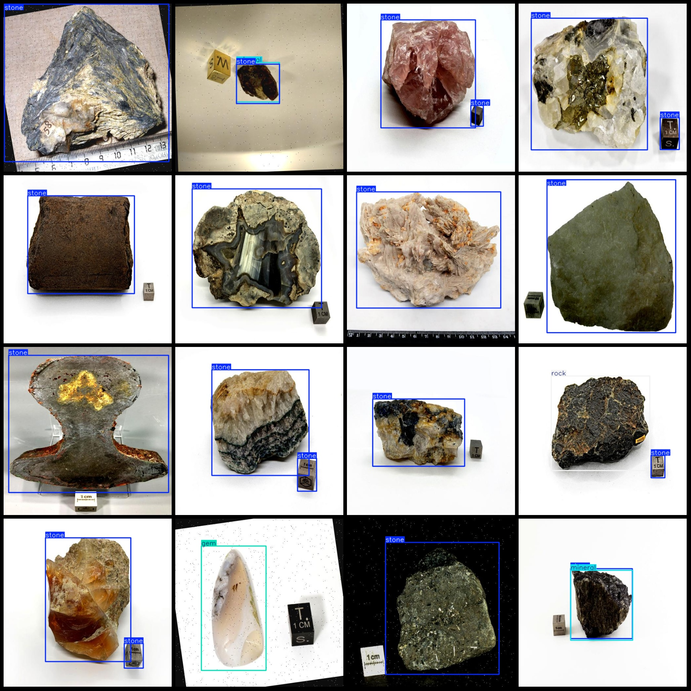
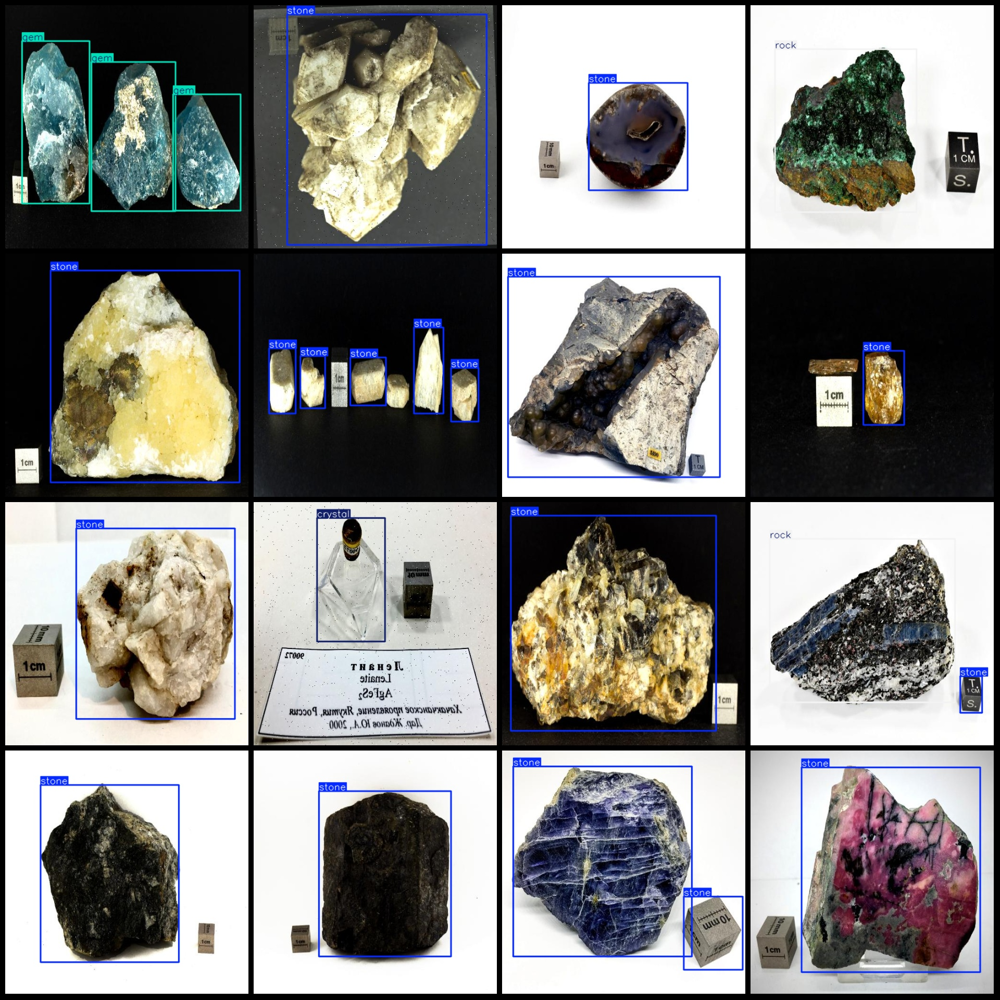

# Mineral, Gemstone, Rock, Stone, Crystal Detection Dataset - VOC+YOLO - 20308 Images - 6 Classes

Dataset format: Pascal VOC format + YOLO format (txt files without split paths, only containing jpg images and corresponding VOC format xml files and yolo format txt files)
Image count (number of jpg files): 20308
Annotation count (number of xml files): 20308
Annotation count (number of txt files): 20308
Number of categories: 6
Label order in the yolo format does not correspond to this one, but is based on the labels folder's classes.txt file: ["crystal", "gem", "mineral", "mineral ore", "rock", "stone"]
Box counts for each category:
Crystal (crystal) = 787
Gem (gem) = 1866
Mineral (mineral) = 3426
Mineral ore (mineral ore) = 841
Rock (rock) = 3297
Stone (stone) = 23039
Total boxes: 33256
Number of images per category:
The number of crystal images is 676.
The gemstone has 1319 images.
The number of images containing the term "mineral" is 2316.
Mineral ore images = 455  
Rock images = 2958
The number of images owned by "stone" is 16531.
image resolution: 512x512  
Use annotation tool: labelImg
Annotation rules: draw a rectangle around the class
Important notes: The dataset does not have a training, validation, and test set; you need to divide it yourself.
Please note that the dataset has not been split into training, validation, and test sets. You will need to do this yourself.
Special Notice: This dataset does not guarantee the accuracy of the trained model or weight files.
Image preview:

## Images

Here is a pay link on Stripe ( https://buy.stripe.com/3cs8yP7sY87d0vu9AB ). Please contact me lonlonago@foxmail.com after funding $89, and I will send you a complete data files , thank you!

